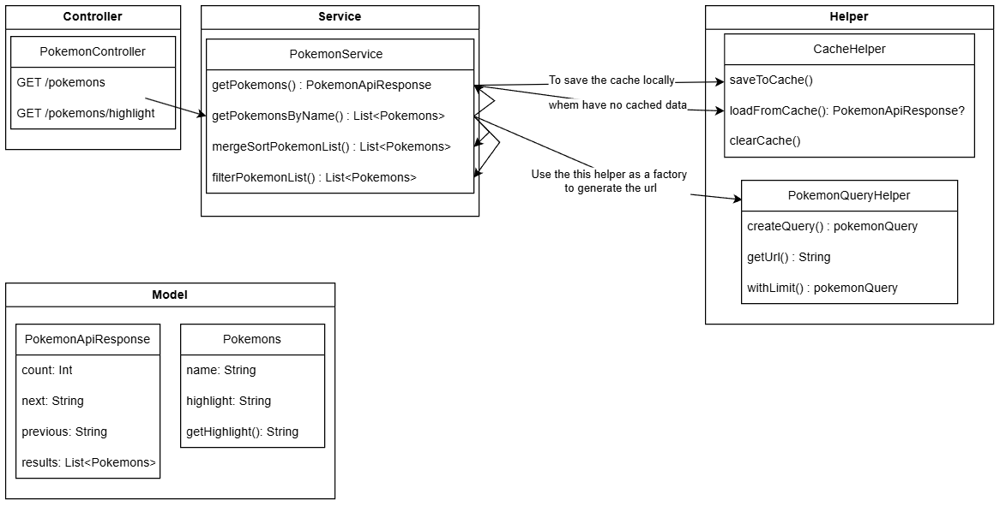
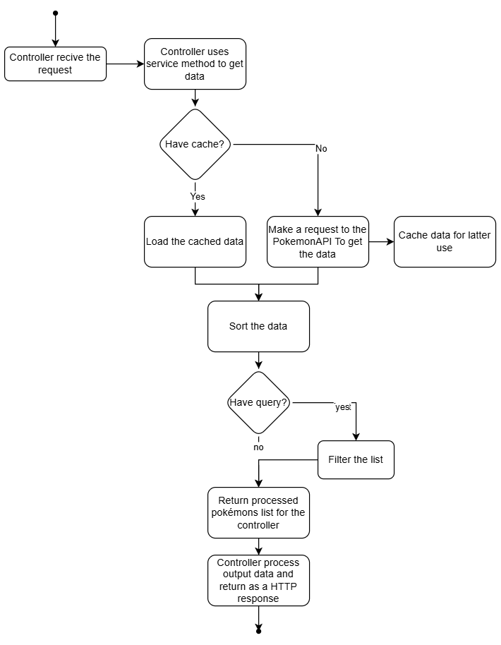

# PokeDex Microservice

## Description
The **PokeDex Microservice** is a lightweight and scalable REST API developed with **Spring Boot** and **Kotlin** for the looqbox backend challenge.

## Technologies Used
- **Language**: Kotlin
- **Framework**: Spring Boot 3.4.2
- **Dependency Management**: Gradle
- **Containerization**: Docker
- **JDK**: 17

## How to Run the Project

### 1. Clone the Repository
```sh 
git clone <REPOSITORY_URL>
cd looqbox-challenge
```

### 2. Build the Project
If running locally without Docker:
```sh
./gradlew build
```

### 3. Run with Docker

#### 3.1. Build the Docker Image
```sh
docker build -t pokedex-microservice .
```

#### 3.2. Run the Container
```sh
docker run -p 8080:8080 pokedex-microservice
```

## Endpoints

| Method | Endpoint | Description                                                                   |
|--------|-------------------------------------------|-------------------------------------------------------------------------------|
| GET    | `/pokemons` | Lists Pokemon filtered by name and sorted                                     |
| GET    | `/pokemons/highlight` | List of Pokemon with the searched part highlighted with filtering and sorting |

### Parameters
- **query**: String, optional. If empty, lists all Pokemon from PokeAPI.
- **sort**: String. Defaults to alphabetical sorting if not provided. (accepts alphabetical and length as input) 

## Class diagram



## Flow diagram


